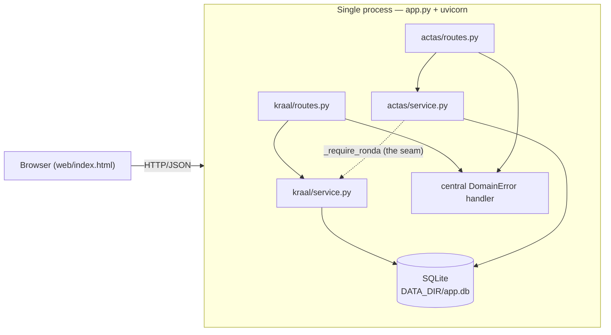
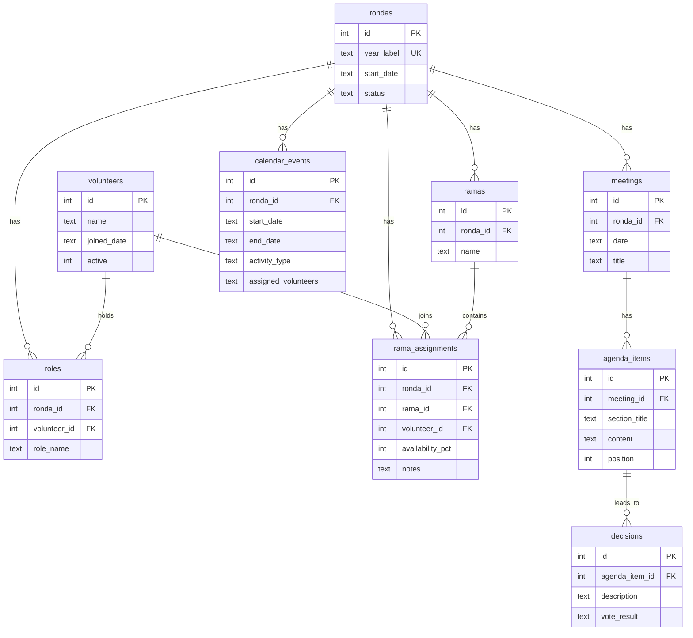

# Asociación Guias de Torrelodones: Management App

This is a minimal, single-process app to replace the manual Google Drive and paper approach AGT (Asociacion Guías de Torrelodones) currently uses to track its Kraal (group of adult volunteers), its ramas (groups of children separated by age) and meeting minutes across each year. Right now the process is fully on paper with important details being announced in a whatsapp group chat.

## Requirements:
- Python 3.10 or newer (the code uses `str | None` syntax)
- No external database: everything is stored in one SQLite file

## SETUP
```bash
git clone <your-repo-url>
cd guidesSystem
python -m venv venv
source venv/bin/activate        # Windows: venv\Scripts\Activate.ps1
pip install -r requirements.txt
```

## How to run:
```bash
python app.py
```

Then open:

- `http://localhost:8000/` : the web UI
- `http://localhost:8000/docs` : interactive API documentation (Swagger)
- `http://localhost:8000/health` : health check

The database schema is created automatically on first start. There is no manual setup step or migration to run.
### Environment variables

| Variable | Default | Purpose |
|---|---|---|
| `PORT` | `8000` | Port the server listens on |
| `DATA_DIR` | `./data` | Folder where the SQLite file (`app.db`) is stored |

Example, running on a different port with a different data folder:

```bash
PORT=9001 DATA_DIR=/tmp/guides-data python app.py
```


## Running tests and coverage

```bash
python -m pytest -q
python -m pytest --cov=src.kraal.service --cov=src.actas.service --cov-report=term-missing
```

The first command runs all tests. The second measures coverage on the two
service files, which hold the core business logic (§4 of the assignment
scopes coverage to business logic, not routing/framework glue).

**Result:** `<fill in once measured — e.g. "94% (12 lines missing in
add_calendar_event)">`

## Feature domains
Two feature domains, both scoped to a ronda, sharing one SQLite database:

1. **Kraal & Rama Management** (`src/kraal/`) — who is on the team this year.
   Volunteers, directive roles (one per ronda, e.g. "Presidenta"), ramas
   (age-based groups), and rama assignments. Includes a **continuity report**
   that compares two rondas' rosters and reports who joined, who left, who
   stayed, and who moved rama.
2. **Meeting & Decision Log — Actas** (`src/actas/`) — what was discussed and
   decided. Meetings, ordered agenda items, decisions (with an optional vote
   result), and a calendar of activities.

The only link between the two domains is `ronda_id`: every meeting and
calendar event belongs to a ronda, but nothing in this domain references a
specific volunteer or rama. That is a deliberate boundary (see `ADR.md`,
entry 2), meant to keep the two domains loosely coupled enough to become
separate services later.

## Architecture

```
Browser  --HTTP/JSON-->  FastAPI routes  -->  service layer  -->  SQLite
         <--------------                  (business rules)      (one file)
```



**Layers, bottom to top:**

- **`schema.sql`** — table definitions and constraints (below).
- **`db.py`** — opens the SQLite connection, enables foreign keys, and runs
  the schema on every startup (`init_db`, safe to re-run because every
  `CREATE TABLE` uses `IF NOT EXISTS`).
- **`errors.py`** — a small hierarchy of business-rule errors
  (`InvalidInputError` → 400, `NotFoundError` → 404, `ConflictError` → 409),
  each carrying its own HTTP status code.
- **`kraal/service.py`, `actas/service.py`** — plain Python functions holding
  all the business rules. No FastAPI import here, so they can be (and are)
  tested without a web server.
- **`kraal/schemas.py`, `actas/schemas.py`** — Pydantic models describing the
  shape of each request body (types, required fields).
- **`kraal/routes.py`, `actas/routes.py`** — thin HTTP wrappers: parse input,
  call the matching service function, return the result. No error handling
  here — every raised `DomainError` is caught in one place.
- **`app.py`** — wires everything together, runs the schema on startup, and
  registers the single exception handler that turns any `DomainError` into
  the right HTTP response.

## Database schema



Key rules the database itself enforces, not just the Python code:

- One role name per ronda (`UNIQUE(ronda_id, role_name)`), e.g. only one
  "Presidenta" per year.
- One rama per volunteer per ronda (`UNIQUE(ronda_id, volunteer_id)` on
  `rama_assignments`) — this is why the roster and the continuity report can
  safely assume each volunteer has exactly one rama in a given ronda.
- `availability_pct` must be between 0 and 100.
- A calendar event's `end_date` cannot be before its `start_date`.
- All foreign keys are enforced (`PRAGMA foreign_keys = ON`).

See `ADR.md` entry 3 for the reasoning behind the denormalized `ronda_id` on
`rama_assignments`.

## API summary

### Kraal (`/api/kraal`)

| Method | Path | Does |
|---|---|---|
| POST | `/rondas` | Create a ronda |
| GET | `/rondas` | List rondas |
| POST | `/volunteers` | Add a volunteer |
| POST | `/rondas/{ronda_id}/roles` | Assign a role |
| POST | `/rondas/{ronda_id}/ramas` | Create a rama |
| POST | `/ramas/{rama_id}/members` | Add a volunteer to a rama |
| GET | `/rondas/{ronda_id}/roster` | Roster grouped by rama |
| GET | `/continuity?prev=&new=` | Compare two rondas' rosters |

### Actas (`/api/actas`)

| Method | Path | Does |
|---|---|---|
| POST | `/meetings` | Create a meeting |
| GET | `/meetings?ronda_id=` | List meetings for a ronda |
| GET | `/meetings/{id}` | Meeting with nested agenda and decisions |
| POST | `/meetings/{id}/agenda` | Add an agenda item |
| POST | `/agenda/{id}/decisions` | Record a decision |
| POST | `/calendar` | Add a calendar event |
| GET | `/calendar?ronda_id=` | List calendar events for a ronda |

Full request/response schemas are available interactively at `/docs` once the
app is running.

## Known limitations

- **No authentication.** Anyone with network access to the app can read and
  write everything. See `ADR.md` entry 5 for why, given this app's scope.
- **`assigned_volunteers` on calendar events is free text**, not linked to
  the `volunteers` table, by design (keeps the two domains decoupled — see
  `ADR.md` entry 2). It has no integrity checking and is not searchable by
  volunteer.
- **The continuity report matches ramas by name across years** (a "Guías"
  rama in 2025 and one in 2026 are separate database rows, matched by
  matching text). Renaming a rama between rondas would be read as the
  volunteer moving to a new rama.
- **Single SQLite file, single process.** This fits the assignment's
  single-container constraint; it is not designed for concurrent writers at
  scale.

## Project structure

```
guidesSystem/
├── app.py                  # entry point: wires routers, runs schema, error handler
├── requirements.txt        # pinned dependencies (one manifest, per assignment)
├── pytest.ini
├── ADR.md                  # architecture decision log
├── AI_USAGE.md              # AI usage log
├── src/
│   ├── schema.sql
│   ├── db.py
│   ├── errors.py
│   ├── kraal/               # Domain 1: service.py, schemas.py, routes.py
│   └── actas/                # Domain 2: service.py, schemas.py, routes.py
├── tests/                   # unit tests (service) + API smoke tests
├── web/
│   └── index.html            # minimal read-only frontend
└── data/                    # SQLite file lives here (gitignored)
```