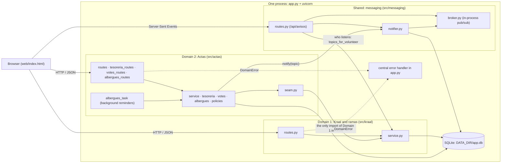
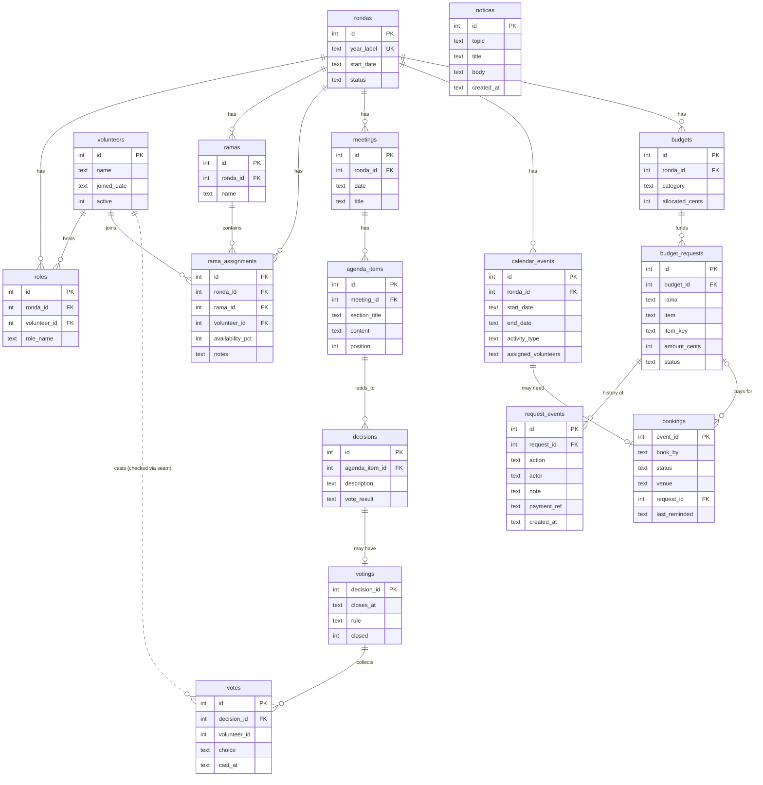

# Asociación Guías de Torrelodones: Management App

A single-process web app for AGT (Asociación Guías de Torrelodones) to run its
**kraal** (the team of adult volunteers) across each Guiding year, or **ronda**.
Today this happens on paper, in Google Drive and in a WhatsApp group chat, where
important details get lost. The app keeps in one place:

- who is in the kraal this year, which **rama** (age group of children) they lead
  and which role they hold, and how the team changed since last year;
- meeting minutes (**actas**) with agenda items, decisions and **named votes**,
  so people who can't attend can still vote before the deadline;
- the **treasury** (tesorería): budgets per category, money requests from the
  ramas checked against what is left, approval and payment by the treasurer, and
  a history that works as the payment receipt;
- **outings and albergues**: each outing that needs accommodation gets a booking
  deadline, and the kraal is reminded until it is booked;
- **live notices** (avisos): each person instantly receives the notices for the
  whole kraal, for their rama and for their roles, and nothing else.

The interface is in Spanish, because that is the language of the association.

## Requirements

- Python 3.10 or newer (the code uses `str | None` syntax)
- No external database or service: everything is stored in one SQLite file
- No internet connection needed at runtime: the web page has no external
  scripts, fonts or stylesheets

## Setup

```bash
git clone https://github.com/oliespineira/guidesSystem.git
cd guidesSystem
python -m venv venv
source venv/bin/activate        # Windows PowerShell: venv\Scripts\Activate.ps1
pip install -r requirements.txt
```

## How to run

```bash
python app.py
```

The server listens on `0.0.0.0:8000`, which means it accepts connections on every
network interface (this machine, and other devices on the same network). `0.0.0.0`
is a listening address, not one a browser can open, so open:

- `http://localhost:8000/` : the web app
- `http://localhost:8000/docs` : interactive API documentation (Swagger)
- `http://localhost:8000/health` : health check

From another device on the same network, use this computer's IP address instead
of `localhost` (for example `http://192.168.1.20:8000`).

The database schema is created automatically on every start. There is no manual
setup step or migration to run. Stop the server with **Ctrl+C**; open live-notice
streams are given 3 seconds to close, so shutdown never hangs.

If you see `[Errno 10048]` (Windows) or `Address already in use`, another copy of
the app is already running on that port: stop it, or start this one with a
different `PORT`.

### Environment variables

Every setting has a default, so none is required.

| Variable | Default | Purpose |
|---|---|---|
| `PORT` | `8000` | Port the server listens on |
| `DATA_DIR` | `./data` | Folder where the SQLite file (`app.db`) is stored |
| `APPROVAL_POLICY` | `reject_over_budget` | What happens when a rama asks for money: `reject_over_budget`, `auto_approve_small` or `always_to_meeting` (see [Treasury](#treasury-tesorería)) |
| `AUTO_APPROVE_LIMIT_CENTS` | `5000` (50 €) | Limit under which `auto_approve_small` approves without the treasurer |
| `TREASURER_ROLE` | `Tesorera` | Name of the role that may approve, reject and pay requests, and that is notified of new ones |
| `BOOKING_LEAD_DAYS` | `90` | Default booking deadline: this many days before the outing starts |
| `BOOKING_REMIND_DAYS` | `14` | Reminders start this many days before the booking deadline |
| `BOOKING_CHECK_SECONDS` | `3600` | How often the background task checks booking deadlines |

Example, on a different port with a different data folder:

```bash
PORT=9001 DATA_DIR=/tmp/guides-data python app.py
```

```powershell
# Windows PowerShell
$env:PORT = 9001; $env:DATA_DIR = "C:\temp\guides-data"; python app.py
```

## Using the app

1. On the first visit a short presentation page appears. Click **Comenzar** to
   enter the app. It is remembered in the browser, and the sidebar link
   **Ver la presentación** opens it again.
2. At the top, pick the **ronda** (or create one with **Nueva ronda**, which can
   also create the five usual ramas in one click) and choose who you are in
   **Estoy usando la app como**. That choice decides which notices you receive and
   what you may do (for example, only the treasurer sees the approve buttons).
3. The sidebar has five sections:
   - **Avisos**: your live notice board, and a form to post a notice to the whole
     kraal, one rama or one role.
   - **Kraal y ramas**: volunteers, ramas, roles, the roster and the continuity
     report between two rondas.
   - **Reuniones y votos**: meetings, agenda items, decisions and named votes.
   - **Tesorería**: budgets, money requests, approval, payment and history.
   - **Salidas y albergues**: the outings calendar and albergue bookings.

## Features

### Kraal and ramas

Volunteers, ramas and roles are organised **per ronda**, because the team changes
every year. A volunteer is in at most one rama per ronda, and each role name
(for example "Presidenta") is held by one person per ronda. The **continuity
report** compares two rondas and says who joined, who left, who stayed and who
moved to a different rama.

### Meetings and named votes

A meeting has ordered agenda items, and each item can record decisions. A vote
can be opened on a decision with a closing time and a counting rule:

- `majority_of_cast`: more yes than no among the people who voted;
- `majority_of_kraal`: more than half of the whole kraal must vote yes, so not
  voting counts against.

Only kraal members of that ronda (in a rama or holding a role) can vote, each
person votes once, and nobody can vote after the closing time. When the vote is
closed, the result is written on the decision and announced to the whole kraal.

### Treasury (tesorería)

Each ronda has budgets per category (for example "Material", 500 €). A rama asks
for money from a budget, and the configured **approval policy** decides what
happens first:

| `APPROVAL_POLICY` | Over the remaining budget | Within budget |
|---|---|---|
| `reject_over_budget` (default) | rejected | waits for the treasurer |
| `auto_approve_small` | rejected | approved if ≤ `AUTO_APPROVE_LIMIT_CENTS`, otherwise waits for the treasurer |
| `always_to_meeting` | waits, to be decided at the next meeting | waits, to be decided at the next meeting |

The request then moves through `pending → approved → paid` or
`pending → rejected`. **Only the volunteer holding the treasurer role in that
ronda** (`TREASURER_ROLE`) may approve, reject or mark a request as paid; anyone
else gets `403 Forbidden`. Anyone may submit a request. Approving checks the
budget again, so two requests can never together spend more than the budget.

When a request is submitted, the app warns if another rama already asked for the
same item this ronda (so it can be bought once for everyone). Every step is
saved in an append-only history with the real name of who did it and the payment
reference, which serves as the receipt. The treasurer is notified of new
requests, and the rama is notified when its request is approved, rejected or paid.

### Outings and albergues

Outings live in the ronda's calendar. Marking an outing as needing an albergue
sets a booking deadline (by default `BOOKING_LEAD_DAYS` before it starts). A
background task inside the same process checks deadlines every
`BOOKING_CHECK_SECONDS` and reminds the whole kraal, at most once a day per
outing, from `BOOKING_REMIND_DAYS` before the deadline until it is booked. When
it is booked, the venue is recorded and the treasury request that paid for it
can be linked.

### Live notices (avisos)

Notices are published to **topics** such as `ronda.5.all`,
`ronda.5.rama.guias` or `ronda.5.role.tesorera`. Names are turned into slugs, so
"Guías", "guias" and "GUIAS" reach the same rama. Each person is subscribed to
the whole-kraal topic, their rama's topic and one topic per role they hold. The
page receives notices instantly over **Server-Sent Events**; a notice is saved in
the database before it is delivered, so someone who was offline gets the ones
they missed when they reconnect.

## Architecture


```mermaid
flowchart LR
  Browser["Browser (web/index.html)"] -->|"HTTP / JSON"| KR
  Browser -->|"HTTP / JSON"| Routes
  Browser -->|"Server-Sent Events"| Stream

  subgraph App["One process: app.py + uvicorn"]
    subgraph D1["Domain 1: Kraal and ramas (src/kraal)"]
      KR["routes.py"] --> KS["service.py"]
    end
    subgraph D2["Domain 2: Actas (src/actas)"]
      Routes["routes · tesoreria_routes · votes_routes · albergues_routes"] --> AS["service · tesoreria · votes · albergues · policies"]
      AS --> Seam["seam.py"]
      Task["albergues_task (background reminders)"] --> AS
    end
    subgraph M["Shared: messaging (src/messaging)"]
      Stream["routes.py (/api/avisos)"] --> Broker["broker.py (in-process pub/sub)"]
      Stream --> Notifier["notifier.py"]
      Notifier --> Broker
    end
    Seam -->|"the only import of Domain 1 in Actas"| KS
    Stream -->|"who listens: topics_for_volunteer"| KS
    AS -->|"notify(topic)"| Notifier
    KS --> DB[("SQLite: DATA_DIR/app.db")]
    AS --> DB
    Notifier --> DB
    Routes -. "DomainError" .-> EH["central error handler in app.py"]
    KR -. "DomainError" .-> EH
  end
```

**Layers, bottom to top:**

- **`schema.sql`**: all 16 tables and their constraints. Every statement uses
  `IF NOT EXISTS`, so it runs safely on every start.
- **`db.py`**: opens a SQLite connection per request, turns on foreign keys, runs
  the schema (`init_db`) and provides `require_row`, which raises a 404 error for
  a missing row.
- **`errors.py`**: business-rule errors that carry their HTTP status:
  `InvalidInputError` → 400, `ForbiddenError` → 403, `NotFoundError` → 404,
  `ConflictError` → 409.
- **`validation.py`**: shared check that a text field isn't blank.
- **Service modules** (`kraal/service.py`, `actas/service.py`, `tesoreria.py`,
  `votes.py`, `albergues.py`, `policies.py`): plain Python functions and classes
  with all the business rules. They don't import FastAPI, so they are tested
  without a web server.
- **`schemas.py`** (per package): Pydantic models for the shape of each request
  body. Pydantic checks types and required fields; the services check the rules.
- **Route modules**: thin HTTP wrappers that parse input, call one service
  function and return the result. They contain no `try/except`: any
  `DomainError` is turned into a JSON response by the single handler in `app.py`.
- **`app.py`**: creates the schema, the broker, the notifier and the reminder
  task on startup (FastAPI `lifespan`), registers the routers and the error
  handler, and serves `web/index.html`.

**Design patterns used where they solve a real problem:**

- **Strategy**: approval policies (`policies.py`) and vote counting rules
  (`votes.py`) are interchangeable classes chosen by name, so a new rule needs no
  change to the code that uses it.
- **Command**: `Approve`, `Reject` and `MarkPaid` (`tesoreria.py`) each represent
  one state change. A shared `execute` checks the treasurer role, the allowed
  transition and the command's own rule, then updates the request and writes its
  history entry in a single transaction.
- **Publish/subscribe (not Observer)**: the broker delivers each notice to every
  open stream whose topic patterns match. Unlike Observer, the publisher never
  holds references to its listeners; it only knows a topic name.
- **Dependency injection**: the database connection, the active policy and the
  notifier reach the routes through FastAPI `Depends`, so tests can replace them
  with fakes.

### The boundary between the two domains

The two domains share one database but are kept loosely coupled, so they could
become separate services later (see `ADR.md`, entry 2):

1. **In the code:** `src/actas/seam.py` is the only file in Domain 2 that imports
   Domain 1. It answers three questions: does this ronda exist
   (`require_ronda`), who is in the kraal this ronda (`electorate`,
   `require_voter`) and who holds a role (`role_holders`, `require_role`). In a
   split, each of these functions would become one HTTP call.
2. **In the database:** Domain 2 links to Domain 1 only through `ronda_id`.
   `votes.volunteer_id` and `budget_requests.rama` deliberately have no foreign
   key into Domain 1's tables; they are checked through the seam, or are free text.
3. **Through notices, by name only:** Domain 2 publishes to a topic such as
   `ronda.5.rama.guias` without knowing who is in that rama; Domain 1 decides who
   listens (`topics_for_volunteer`). Notices belong to neither domain.

## Database schema

16 tables. Solid lines are foreign keys; the dotted lines are the deliberate links
without a foreign key described above.


```mermaid
erDiagram
  rondas ||--o{ roles : has
  rondas ||--o{ ramas : has
  rondas ||--o{ rama_assignments : has
  volunteers ||--o{ roles : holds
  volunteers ||--o{ rama_assignments : joins
  ramas ||--o{ rama_assignments : contains

  rondas ||--o{ meetings : has
  rondas ||--o{ calendar_events : has
  rondas ||--o{ budgets : has
  meetings ||--o{ agenda_items : has
  agenda_items ||--o{ decisions : leads_to
  decisions ||--o| votings : "may have"
  votings ||--o{ votes : collects
  volunteers ||..o{ votes : "casts (checked via seam)"
  budgets ||--o{ budget_requests : funds
  budget_requests ||--o{ request_events : "history of"
  calendar_events ||--o| bookings : "may need"
  budget_requests |o--o{ bookings : "pays for"

  rondas {
    int id PK
    text year_label UK
    text start_date
    text status
  }
  volunteers {
    int id PK
    text name
    text joined_date
    int active
  }
  roles {
    int id PK
    int ronda_id FK
    int volunteer_id FK
    text role_name
  }
  ramas {
    int id PK
    int ronda_id FK
    text name
  }
  rama_assignments {
    int id PK
    int ronda_id FK
    int rama_id FK
    int volunteer_id FK
    int availability_pct
    text notes
  }
  meetings {
    int id PK
    int ronda_id FK
    text date
    text title
  }
  agenda_items {
    int id PK
    int meeting_id FK
    text section_title
    text content
    int position
  }
  decisions {
    int id PK
    int agenda_item_id FK
    text description
    text vote_result
  }
  votings {
    int decision_id PK
    text closes_at
    text rule
    int closed
  }
  votes {
    int id PK
    int decision_id FK
    int volunteer_id
    text choice
    text cast_at
  }
  calendar_events {
    int id PK
    int ronda_id FK
    text start_date
    text end_date
    text activity_type
    text assigned_volunteers
  }
  bookings {
    int event_id PK
    text book_by
    text status
    text venue
    int request_id FK
    text last_reminded
  }
  budgets {
    int id PK
    int ronda_id FK
    text category
    int allocated_cents
  }
  budget_requests {
    int id PK
    int budget_id FK
    text rama
    text item
    text item_key
    int amount_cents
    text status
  }
  request_events {
    int id PK
    int request_id FK
    text action
    text actor
    text note
    text payment_ref
    text created_at
  }
  notices {
    int id PK
    text topic
    text title
    text body
    text created_at
  }
```

Rules the database itself enforces, not just the Python code:

- One person per role name per ronda (`UNIQUE(ronda_id, role_name)`).
- One rama per volunteer per ronda (`UNIQUE(ronda_id, volunteer_id)` on
  `rama_assignments`; `ronda_id` is repeated there on purpose, see `ADR.md` entry 3).
- `availability_pct` between 0 and 100; an event's `end_date` not before its
  `start_date`.
- One budget per category per ronda; amounts stored as whole **cents**, never
  negative, and requests always above zero.
- Request status is one of `pending`, `approved`, `rejected`, `paid`.
- At most one vote per decision (`decision_id` is the primary key of `votings`),
  one ballot per person (`UNIQUE(decision_id, volunteer_id)`), and the choice is
  `yes`, `no` or `abstain`.
- At most one booking per outing (`event_id` is the primary key of `bookings`).
- `request_events` is append-only: the code only ever inserts into it.
- All foreign keys are enforced (`PRAGMA foreign_keys = ON`).

Because new features only add tables and every statement uses
`CREATE TABLE IF NOT EXISTS`, an existing database gets new tables on the next
start. A change to an **existing** table does not reach a database that was
already created; delete `data/app.db` to rebuild it.

## API summary

All bodies are JSON. Errors come back as `{"detail": "..."}` with status 400
(invalid input), 403 (not allowed for this volunteer), 404 (not found), 409
(conflict with the current state) or 422 (wrong body shape). Full schemas are at
`/docs` while the app is running.

### General

| Method | Path | Does |
|---|---|---|
| GET | `/` | The web app |
| GET | `/health` | Health check |

### Kraal (`/api/kraal`)

| Method | Path | Does |
|---|---|---|
| POST | `/rondas` | Create a ronda |
| GET | `/rondas` | List rondas |
| POST | `/volunteers` | Add a volunteer |
| GET | `/volunteers` | List volunteers |
| POST | `/rondas/{ronda_id}/roles` | Give a volunteer a role in a ronda |
| GET | `/rondas/{ronda_id}/roles` | List the roles of a ronda |
| POST | `/rondas/{ronda_id}/ramas` | Create a rama |
| GET | `/rondas/{ronda_id}/ramas` | List the ramas of a ronda |
| POST | `/ramas/{rama_id}/members` | Add a volunteer to a rama |
| GET | `/rondas/{ronda_id}/roster` | Roster grouped by rama |
| GET | `/continuity?prev=&new=` | Compare two rondas' rosters |

### Actas: meetings and calendar (`/api/actas`)

| Method | Path | Does |
|---|---|---|
| POST | `/meetings` | Create a meeting |
| GET | `/meetings?ronda_id=` | List the meetings of a ronda |
| GET | `/meetings/{meeting_id}` | Meeting with its agenda and decisions |
| POST | `/meetings/{meeting_id}/agenda` | Add an agenda item |
| POST | `/agenda/{agenda_item_id}/decisions` | Record a decision |
| POST | `/calendar` | Add an outing or activity |
| GET | `/calendar?ronda_id=` | List the calendar of a ronda |

### Votes (`/api/actas/decisions`)

| Method | Path | Does |
|---|---|---|
| POST | `/{decision_id}/vote` | Open a vote (`closes_at`, `rule`); notifies the kraal |
| POST | `/{decision_id}/votes` | Cast a vote (`volunteer_id`, `choice`) |
| GET | `/{decision_id}/votes` | Current tally and who voted what |
| POST | `/{decision_id}/vote/close` | Close and count after the closing time; notifies the kraal |

### Treasury (`/api/actas`)

| Method | Path | Does |
|---|---|---|
| POST | `/budgets` | Create a budget |
| GET | `/budgets?ronda_id=` | Budgets with what is left of each |
| GET | `/treasury?ronda_id=` | The treasurer role name and who holds it |
| POST | `/budgets/{budget_id}/requests` | Ask for money (anyone); applies the approval policy and notifies |
| GET | `/requests?ronda_id=` | List the requests of a ronda |
| POST | `/requests/{request_id}/approve` | Approve (`volunteer_id`, must be the treasurer) |
| POST | `/requests/{request_id}/reject` | Reject (`volunteer_id`, must be the treasurer) |
| POST | `/requests/{request_id}/pay` | Mark as paid (`volunteer_id`, `payment_ref`, must be the treasurer) |
| GET | `/requests/{request_id}/history` | Full history of a request |

### Albergues (`/api/actas`)

| Method | Path | Does |
|---|---|---|
| POST | `/calendar/{event_id}/booking` | Mark an outing as needing an albergue (optional `book_by`) |
| POST | `/calendar/{event_id}/booking/done` | Record the booking (`venue`, optional `request_id`) |
| GET | `/bookings?ronda_id=` | Bookings with days left and an urgent flag |

### Notices (`/api/avisos`)

| Method | Path | Does |
|---|---|---|
| POST | `/api/avisos` | Post a notice to `all`, a `rama` or a `role` |
| GET | `/topics?ronda_id=&volunteer_id=` | The topics a volunteer receives |
| GET | `/stream?ronda_id=&volunteer_id=` | Live notices (Server-Sent Events), including the ones missed |

## Running tests and coverage

```bash
python -m pytest -q
```

Coverage of the business logic (§4 of the assignment scopes coverage to business
logic, not routing or framework glue):

```bash
python -m pytest --cov=src.kraal.service --cov=src.actas.service --cov=src.actas.tesoreria --cov=src.actas.policies --cov=src.actas.votes --cov=src.actas.seam --cov=src.actas.albergues --cov=src.messaging.topics --cov=src.messaging.broker --cov=src.messaging.notifier --cov-report=term-missing
```

**Result: 137 tests pass, 99% coverage** (567 statements, 8 missed):

| File | Coverage |
|---|---|
| `src/actas/albergues.py` | 100% |
| `src/actas/policies.py` | 100% |
| `src/actas/seam.py` | 100% |
| `src/actas/service.py` | 90% |
| `src/actas/tesoreria.py` | 100% |
| `src/actas/votes.py` | 100% |
| `src/kraal/service.py` | 98% |
| `src/messaging/broker.py` | 100% |
| `src/messaging/notifier.py` | 100% |
| `src/messaging/topics.py` | 100% |

Tests use a real in-memory SQLite database (no mocks of the database), fixed
dates instead of the clock, and fake notifiers that record what would have been
sent. `tests/test_api.py` checks the same rules through real HTTP, including the
status codes from the central error handler. The live stream, the reminder loop
and the web page are thin layers over tested functions and were checked by
running the app. See `ADR.md` entry 4.

## Known limitations

- **No login.** Each person chooses who they are at the top of the page. The
  server applies every rule to that volunteer (only the treasurer can approve or
  pay, one vote per person, only kraal members vote), but anyone who can open the
  page can choose to be anyone. This protects against mistakes, not against
  impersonation. Authentication must be added before the app is exposed beyond a
  trusted local network. See `ADR.md` entry 5.
- **Free-text links between domains.** `assigned_volunteers` on outings and
  `rama` on money requests are text, not foreign keys (see `ADR.md` entry 2). They
  aren't checked for typos and can't be searched by volunteer. For the rama of a
  request this is softened in two places: notices use slugs, so "Guias" and
  "Guías" reach the same rama, and the page offers the ronda's ramas in a list.
  Duplicate-request detection, however, compares the rama text exactly.
- **Duplicate requests are found only for the same item text**, after ignoring
  capitals and extra spaces. "tiendas" and "tienda de campaña" are not detected
  as the same thing.
- **The continuity report matches ramas by name** across years. Renaming a rama
  between rondas reads as everyone moving to a new rama.
- **Changes to existing tables need a fresh database** (there is no migration
  tool); see [Database schema](#database-schema).
- **Single SQLite file, single process.** The broker lives in memory, so notices
  are delivered live only by the process that saved them. This fits the
  assignment's single-container constraint; it is not built for several server
  processes or many concurrent writers.

## Project structure

```
guidesSystem/
├── app.py                    # entry point: startup, routers, error handler, serves the page
├── requirements.txt          # pinned dependencies
├── pytest.ini
├── README.md
├── ADR.md                    # architecture decision record
├── AI_USAGE.md               # AI usage log
├── src/
│   ├── schema.sql            # all 16 tables
│   ├── db.py                 # connection, schema on startup, require_row
│   ├── errors.py             # DomainError hierarchy (400/403/404/409)
│   ├── validation.py         # require_text
│   ├── kraal/                # Domain 1: rondas, volunteers, roles, ramas, continuity
│   │   ├── service.py
│   │   ├── schemas.py
│   │   └── routes.py
│   ├── actas/                # Domain 2
│   │   ├── seam.py           # the only file that imports Domain 1
│   │   ├── service.py        # meetings, agenda, decisions, calendar
│   │   ├── routes.py
│   │   ├── tesoreria.py      # budgets, requests, Approve/Reject/MarkPaid commands
│   │   ├── tesoreria_routes.py
│   │   ├── policies.py       # approval policies (Strategy)
│   │   ├── votes.py          # named votes and counting rules (Strategy)
│   │   ├── votes_routes.py
│   │   ├── albergues.py      # booking deadlines and reminders
│   │   ├── albergues_routes.py
│   │   ├── albergues_task.py # in-process background reminder loop
│   │   └── schemas.py
│   └── messaging/            # shared: live notices
│       ├── topics.py         # topic names, slugs, pattern matching
│       ├── broker.py         # in-process publish/subscribe
│       ├── notifier.py       # save a notice, then publish it
│       ├── schemas.py
│       └── routes.py         # /api/avisos, including the SSE stream
├── tests/                    # 137 tests: services, messaging and HTTP
├── web/
│   └── index.html            # the whole interface: HTML, CSS and JS, no external files
└── data/                     # SQLite file lives here (gitignored)
```
